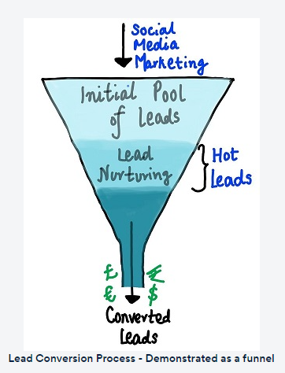
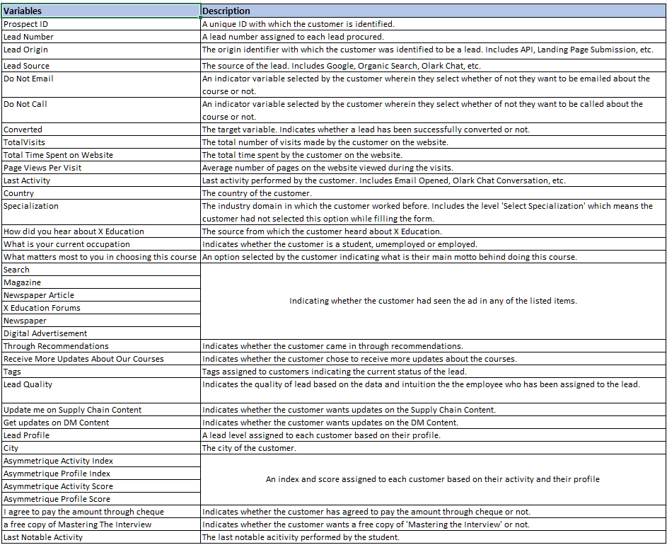

## 📈Lead Scoring Case Study

### 🟪Goals for this case study:

 - 1. Build a **Logistic Regression Model** to assign a lead score between 0 and 100 to each of the leads which can be used by the company to target potential leads. A higher score would mean that the lead is hot, i.e. is most likely to convert whereas a lower score would mean that the lead is cold and will mostly not get converted.
 - 2. There are some more problems presented by the company which your model should be able to adjust to if the company's requirement changes in the future so you will need to handle these as well. These problems are provided in a separate doc file. Please fill it based on the logistic regression model you got in the first step. Also, make sure you include this in your final PPT where you'll make recommendations.

---
### 🤔Problem Statement

An education company named X Education sells online courses to industry professionals. On any given day, many professionals who are interested in the courses land on their website and browse for courses.

The company markets its courses on several websites and search engines like Google. Once these people land on the website, they might browse the courses or fill up a form for the course or watch some videos. When these people fill up a form providing their email address or phone number, they are classified to be a lead. Moreover, the company also gets leads through past referrals. Once these leads are acquired, employees from the sales team start making calls, writing emails, etc. Through this process, some of the leads get converted while most do not. The typical lead conversion rate at X education is around 30%. 

Now, although X Education gets a lot of leads, its lead conversion rate is very poor. For example, if, say, they acquire 100 leads in a day, only about 30 of them are converted. To make this process more efficient, the company wishes to identify the most potential leads, also known as ‘Hot Leads’. If they successfully identify this set of leads, the lead conversion rate should go up as the sales team will now be focusing more on communicating with the potential leads rather than making calls to everyone. A typical lead conversion process can be represented using the following funnel:

As you can see, there are a lot of leads generated in the initial stage (top) but only a few of them come out as paying customers from the bottom. In the middle stage, you need to nurture the potential leads well (i.e. educating the leads about the product, constantly communicating etc. ) in order to get a higher lead conversion.

X Education has appointed you to help them select the most promising leads, i.e. the leads that are most likely to convert into paying customers. The company requires you to build a model wherein you need to assign a lead score to each of the leads such that the customers with a higher lead score have a higher conversion chance and the customers with a lower lead score have a lower conversion chance. The CEO, in particular, has given a ballpark of the target lead conversion rate to be around 80%.

---
### 🚲Business Goal
You are required to model the **demand for shared bikes with the available independent variables**. It will be used by the management to understand how exactly the demands vary with different features. They can accordingly **manipulate the business strategy to meet the demand levels** and meet the customer's expectations. Further, the model will be a good way for management to **understand the demand dynamics** of a new market. 

---
### 1️⃣🔍Data understanding, preparation and EDA (~30%):

✅Meets expectations
 - Data quality checks, if any, are performed, and all data quality issues are addressed in the right way. 
 - Explanations for data quality issues are clearly mentioned in comments.
 - Categorical variables are handled appropriately.
 - Dummy variables are created properly wherever applicable.
 - New metrics are derived if applicable and are used for analysis and modelling.
 - The data is converted to a clean format suitable for analysis.

❌Does not meet expectations
 - Data quality checks, if any, are not done, data quality issues are not addressed correctly to an appropriate level.
 - Categorical variables are not handled appropriately where required.
 - Dummy variables are not created properly.
 - New metrics are not derived or are not used for analysis.
 - The data is not converted to a clean format which is suitable for analysis or is not cleaned using commands.
#### 🪶Data Dictionary

#### 📝Data Preparation

You have been provided with a leads dataset from the past with around 9000 data points. This dataset consists of various attributes such as Lead Source, Total Time Spent on Website, Total Visits, Last Activity, etc. which may or may not be useful in ultimately deciding whether a lead will be converted or not. The target variable, in this case, is the column ‘Converted’ which tells whether a past lead was converted or not wherein 1 means it was converted and 0 means it wasn’t converted. You can learn more about the dataset from the data dictionary provided in the zip folder at the end of the page. Another thing that you also need to check out are the levels present in the categorical variables. Many of the categorical variables have a level called 'Select' which needs to be handled because it is as good as a null value (think why?).

---

### 2️⃣🧑‍💻Model building and evaluation (~40%):

✅Meets expectations
 - Model parameters are tuned using correct principles and the approach is explained clearly. 
 - Both the technical and business aspects are considered while building the model. 
 - Correct variable selection techniques are used. A reasonable number of different models are attempted and the best one is chosen based on key performance metrics.
 - Residual analysis is performed after model building and the assumptions are validated.
 - Model evaluation is done using the correct principles and appropriate evaluation metrics are chosen.
 - The results are on par with the best possible model on the dataset.
 - The model is interpreted and explained correctly. The commented code includes a brief explanation of the important variables and the model in simple terms.

❌Does not meet expectations
 - Parameters are not tuned enough or tuned incorrectly. Relevant business aspects are not considered while model building.
 - Variable selection techniques are used incorrectly / not conducted. A variety of models are not considered or a sub-optimal one is finalised.
 - Residual analysis is not performed after model building and the assumptions are not validated.
 - The evaluation process deviates from correct model selection principles, inappropriate metrics are evaluated or are incorrectly evaluated.
 - The results are not on par with the best possible model on the dataset.
 - The model is not interpreted and explained correctly.

---

## 4️⃣✍️Subjective Questions (~10%):

✅Meets expectations
 - The answer to the subjective questions are clear, concise and to the point.
 - No assumptions are made and the reasons behind the answers are explained clearly.

❌Does not meet expectations
 - The answers are incorrect or unnecessarily long.
 - The assumptions, if any, behind the answers, are not explained and the reasons behind the answers are not given clearly.
### ⏩Assignment-Based Subjective Questions
Please refer the [Assignment PDF](Bike-Sharing-Assignment-Subjective-Questions.pdf)
### ⏩Answers for General Subjective Questions 
Please refer the [Assignment PDF](Bike-Sharing-Assignment-Subjective-Questions.pdf)

 ---
## 4️⃣Presentation and Recommendations (~10%)
✅Meets expectations
 - The presentation has a clear structure, is not too long, and explains the most important results concisely in simple language.
 - The recommendations to solve the problems are realistic, actionable and coherent with the analysis.
 - If any assumptions are made, they are stated clearly.

❌Does not meet expectations
 - The presentation lacks structure, is too long or does not put emphasis on the important observations. The language used is complicated for business people to understand.
 - The recommendations to solve the problems are either unrealistic, non-actionable or incoherent with the analysis.
 - Contains unnecessary details or lacks the important ones.
 - Assumptions made, if any, are not stated clearly.
---
## 5️⃣ Summary Report (~5%)
✅Meets expectations
 - The process followed and all the learnings are clearly mentioned.
 - The report is neither too detailed nor too brief. The 500-word word limit is followed.

❌Does not meet expectations
 - The process followed and learnings are not mentioned clearly and the report keeps deviating from it.
 - The report is too brief or too detailed, i.e., it doesn't stick to the 500-word word limit.

---
## 6️⃣ Conciseness and readability of the code (~5%)
✅Meets expectations
 - The code is concise and syntactically correct. Wherever appropriate, built-in functions and standard libraries are used instead of writing long code (if-else statements, for loops, etc.).
 - Custom functions are used to perform repetitive tasks.

❌Does not meet expectations
 - Long and complex code used instead of shorter built-in functions.
 - Custom functions are not used to perform repetitive tasks resulting in the same piece of code being repeated multiple times.
 - Code readability is poor because of vaguely named variables or lack of comments wherever necessary.

---

## 💼Submissions:

 - **Python Notebook**: One Python notebook with the whole linear model, predictions, and evaluation. [Lead Scoring Jupyter Notebook](./lead-scoring-case-study.ipynb)
 - **Word File (Subjective Questions)**: Answer all the questions asked by the company in the word document provided. [Word File - Subjective Questions](./Assignment%20Subjective%20Questions.docx) 
 - **Presentation PDF**:  Make a presentation to present your analysis to the chief data scientist of your company (and thus you should include both technical and business aspects). The presentation should be concise, clear, and to the point. Submit the presentation after converting it into PDF format - [Lead Scoring Presentation](./lead-scoring-case-study.pdf)
 - **Summary Report PDF**: Apart from the Python notebook, you also need to answer some subjective questions related to linear regression which can be downloaded from the file below. Answer these questions and submit it as a PDF. [Lead Scoring Summary Report](Bike-Sharing-Assignment-Subjective-Questions.pdf)

💡`Note`: There are some questions in the subjective questions doc that you might not be familiar with. So you're expected to research these questions and give an appropriate answer in order to expand your learnings of this topic.

---

## Team Members:
 - Rekha Vinothkumar
 - Vimal Nelson
 - Vijay Mahawar

---

## 📖References:
The dataset and data dictionary can be get from link given below:

 - [Lead Scoring Dataset](./dataset/Leads.csv)
 - [Leads Data Dictionary](./dataset/Leads-Data-Dictionary.xlsx)

---
